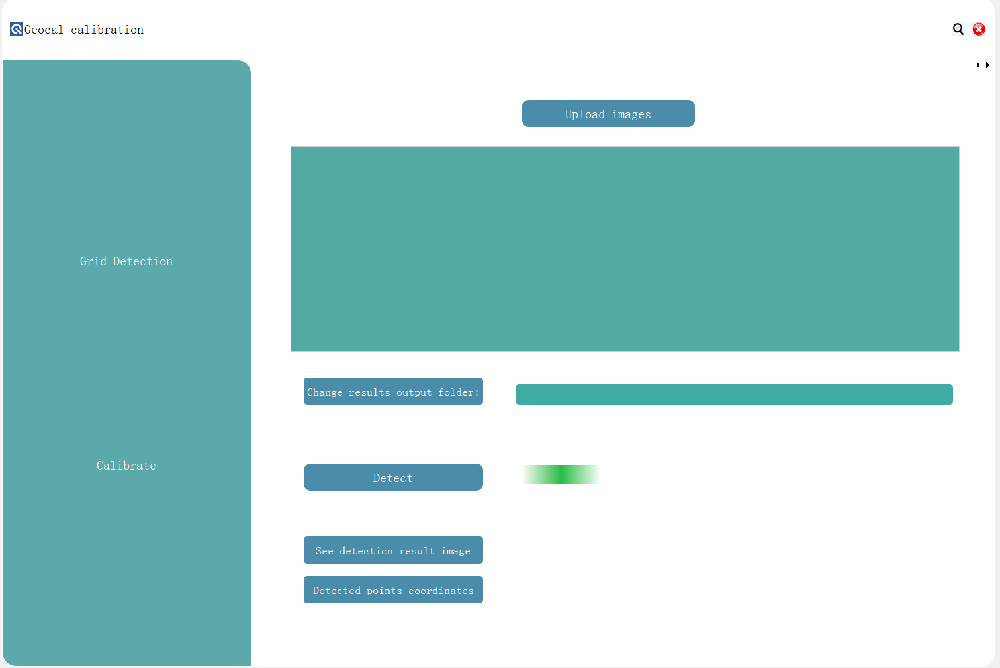
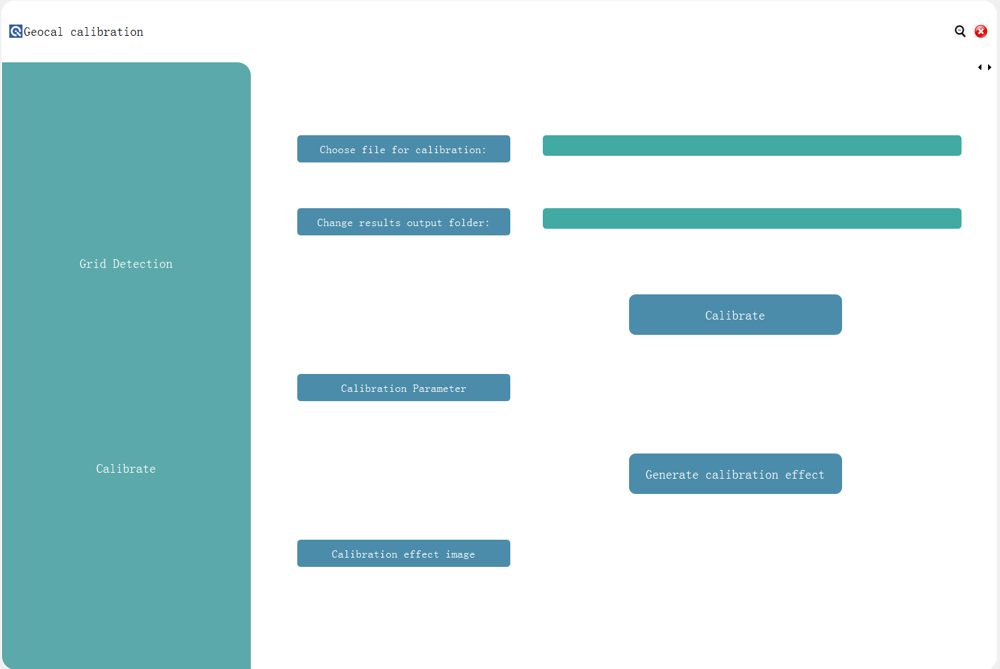

# GEOCAL_calculation

software级别的运行方法：
Run ui.manage.py and GUI interface will show up. It has two pages, one for grid detection and another for calibration.

以下是code级别的运行策略，已经对其作了调整，想要运行还需要把每个脚本里与脚本名称相同的函数改为main函数才可以。
还要改变获取输出路径的语句，变为从yaml中获取。目前是从客户端获取的。
## configuration 
config.yaml includes some parameters that need to be adjusted according to different lens. Before run 
codes below, you should change it.

## Exposure Fusion
Run exposure_fusion.py to merge multiple images with different exposure levels which can show more details in one image.
Exposure image will be stored in "exposure_fusion.bmp"
You should run it with one argument input. In terminal, run as "python exposure_fusion.py images", where "images" folder 
store all your original images.

## Grid Detection
Run centroid.py to detect the feature points and generate grid from photos taken by GEOCAL.\
Use binary processing to find contour of each point and apply centroid method on original image to find peak.\
Use threshold to reject noisy points near the center.\
Use KD-Tree algorithm to abandon one of two points too close together.\
Use either pillow package to draw centroids on sub-pixel level or opencv on pixel level.\
Output files include an original image with centroid on it("output_image_with_centroids_sub.bmp") 
and a txt file with all  centroid coordinates("centroids_coordinates.txt").

## Another Grid Detection method(recommended)
You just need to firstly run first_centroid.py before exposure fusion.
This is designed for short focal length lens, because they have large FOV which means the brightness of the points near 
the center differs greatly from those near the edge. First detecting grid can get better effect.

## Grid generation
Run grid_generation.py in which the former is to generate image coordinates for each point. Supplement missing
points and delete noisy points. Output files include an image with new coordinates on it("output_image_with_coordinates.png") 
and a txt file with all pixel and corresponding new coordinates("final_coordinates.txt").

## Intrinsic matrix
Script intrinsic.py includes functions that getting first version of intrinsic matrix.

## Distortion correction
Script distortion.py includes functions that getting first version of distortion coefficients.

## Extrinsic matrix
Script extrinsic.py includes functions that getting first version of extrinsic matrix.

## Camera calibration
Run calibrate.py to get intrinsic matrix, extrinsic matrix and distortion correction and refine all parameters. Output 
file includes these parameters("calibration result.txt")

## Effect visualization
Run test.py to see image after correction by our model. More coordinates in world coordinate system can be provided and 
the program will output image after distortion correction. There is an example effect of geocal image("calibration_effect.bmp").
